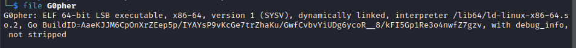
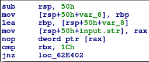
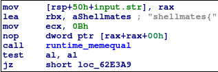
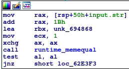
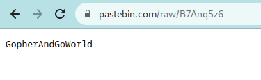
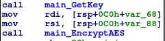
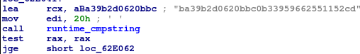
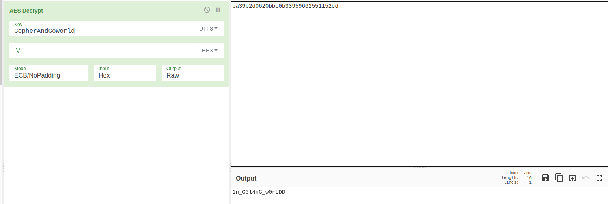
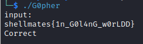

# G0pher WriteUp

## description
    Gopher went on a picnic but he doesn't want you to know, can you follow him and know where?.

## category
    - reverse    
    - programming   

# Solution
 - First of all we try and execute the program it asks for an inputs. Entering something random will result into a length error.

 - So now we know that it is checking for a specific length in our input.

After executing the file command on our binary we see that our binary files has debug info and it was not striped so reading the disassembled code would be a bit easier.

 - now we open our binary in ida and we see that it has more than 4800 functions we can assume that this code was written in go by the amount of unusual functions that don't really serve for anything in the actual program and we also see that it executes the main function in the main.go file using gdb.

 - We see that after scanning our input the program calls a CheckInput function.

(function_checkInput.png)

 - Going thru it we can find where it is checking length and we find it to be 0x1c or 28 characters.

 - checking that function more we can see it compares our first few characters of the input with "shellmates{"
and the last one with "}" to verify the input format.

we can see more clearly how it compares the last characters of the input with "}" in gdb.

 - returning to the main function.

 - It executes a get request using the GetKey function request to this website "https://pastebin.com/raw/B7Anq5z6" where we can find after visiting it some sort of a String "GopherAndGoWorld" that we will need later.

 - after that it encrypts out input with and AES encryption using the EncryptAES in the main function with the key that we found in the pastebin link.

 - after that it compares our encrypted input to this encrypted cypher "ba39b2d0620bbc0b33959662551152cd".

 - then we went to cyberchef and tried decrypting the cypher using the key that we found, and it gave us "1n_G0l4nG_w0rLDD". With this we found the inside part of the flag.

 - entering the flag "shellmates{1n_G0l4nG_w0rLDD}" and testing it on the binary it gave us a "Correct" message.

    
   
    
    
     
ps: r0fx come to ByteCTF and we'll see who's gonna lose his mind